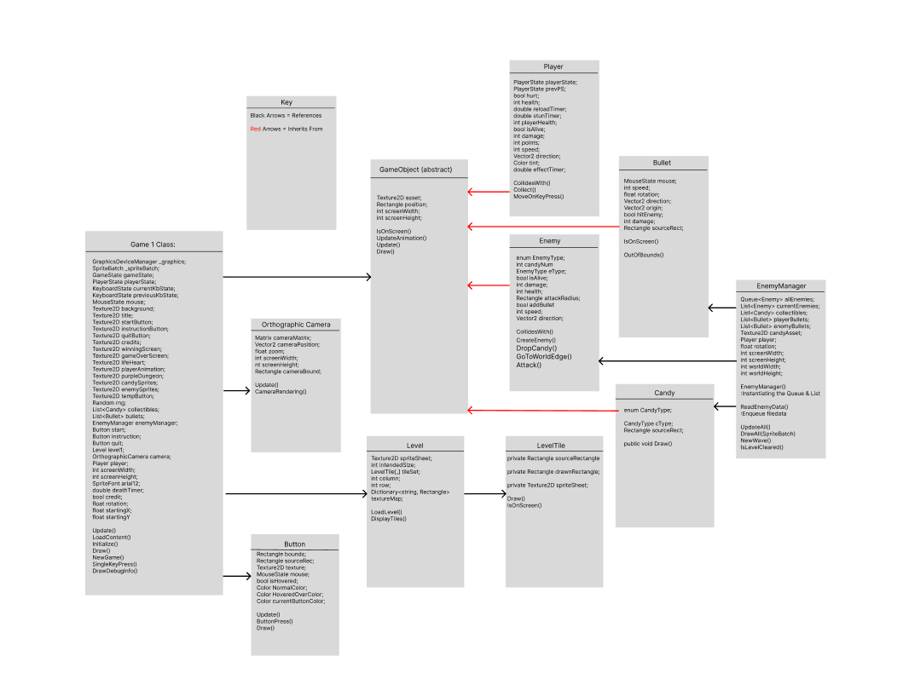
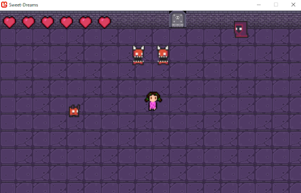
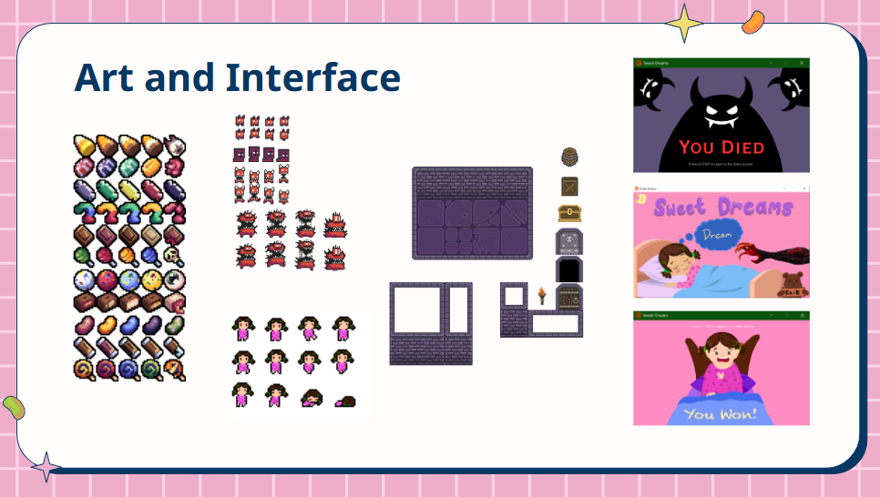

# Sweet-Dreams_SugarRush
A Group Game Project for IGME 106 - Problem Solving with Data Structure and Algorithms for Games.  
Developed Using MonoGame Framework.

## Table of Contents
- [Major Features](#major-features)
- [Architecture Diagram](#architecture-diagram)
- [File IO](#file-io)
- [Design](#design)
- [Art and Interface](#art-and-interface)
- [Post Mortem](#post-mortem)

## Major Features
- Data Driven(File IO)
- Camera System(Matrices)
- Enemy Attack Pattern (Collision Response)
- Three Waves in One Level (Queue/Load)
- Bullet Movement (Linear Algebra & Vectors)

## Architecture Diagram 

### Collision Detection
Implemented **AABB collision detection** using MonoGame's Rectangle Class' Intersects() method in Player and Enemy Class  
-> Why?: We don't have rotating objects, and it is costly and an overkill to use other collision detection methods in this project. 

Improvements that could have been made: Instead of having Player's Health being public, we could have used events and delegates to trigger actions when the player collides with the enemy type. The objects would have been more decoupled this way.

### Camera System
A simple 2D Camera system class is implemented by taking in Player Input as an argument, and a translation matrix is created to handle scrolling. SpriteBatch takes the Camera Matrix returned, and draws the screen, making an illusion that the player moved.

Improvements that could have been made: The Camera Class is tied to the Screen. This makes camera = screen, which shouldn't be happening. Decoupling the camera from the screen size, setting the size to the portion of the world player should see, and using MonoGame's RenderTarget would have yielded better results, and an actual camera class. 

### Player Input
Player Class handles the inputs using Polling every update, structured using Finite State Machines. This is also tied to how Player Animation is implemented.

## File IO
LevelTile Class has a dictionary to manage the name of a tile varation and the mapping done to its source rectangle from the sprite sheet. Along with this data structure set up and text files, we can load in backgrounds as we intended to, without populating one by one.

Addition that can be made: If we were going to have more Procedural Generation Systems on Maps, improvements can be made using WaveFunction Collaspe, which uses the concept of entrophy to populate a random tile map.

## Design 
Cutesy Horror Themed Top-Down Shooter.  
- Additional Feature
  - Candy gives you Power-Up or Debuff!
  - Different Enemy Types (Different AI Logics)
  - Turret Bullets (Able to support 360 degree range)
 
 

## Art and Interface 
Tile, Monster, and Candy Assets were free assets avilable from itch.io. The character sprite sheet was modified by one of our group member, and the interface screen design and the buttons were designed by other two members. We tried our best to also cover art!

## Post Mortem
What we learned  
: How to work with other's code, communicate our work properly, and that bringing creative ideas to life takes a lot of effort, but with collaboration, it is totally achieveable. 

